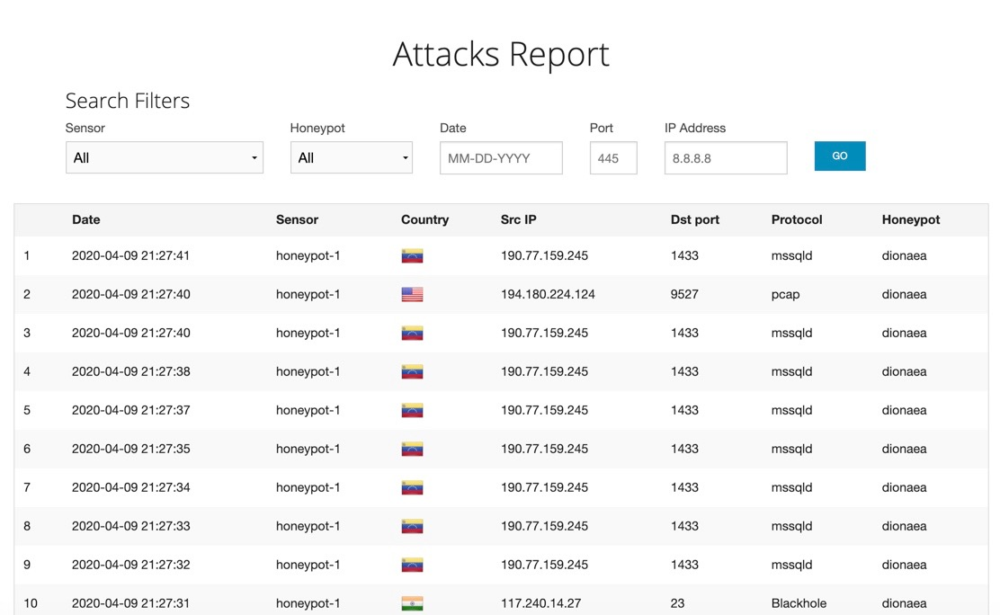

# Weeks 10 & 11 Project: Honeypot

## Overview

In this assignment, you will stand up a basic honeypot and demonstrate its effectiveness at detecting and/or collecting data about an attack. Guided instructions for doing this using specific software are provided below, but you are free to take any approach you wish that demonstrates the following basic principles:

Successful configuration and deployment of a network-accessible honeypot server with two primary features:
 - An attack surface that is vulnerable or exposed in some way to network-based attacks
 - A network security feature such as an IDS configured to detect and log such attacks

Illustration of at least one attack against the honeypot that can be detected or logged in a way that captures information about the attack or the attacker

## Experiment write-up

### Honeypots Deployed

 - Dionaea with HTTP(honeypot-1)
 
### Issues Encountered

I encountered issues when transferring files between the VM and my local OS. This was eventually resolved by researching the error I was receiving and implementing various solutions until completion.

### Summary of Data

All Attacks:

 - Dionaea with HTTP(honeypot-1) = 9219
 

